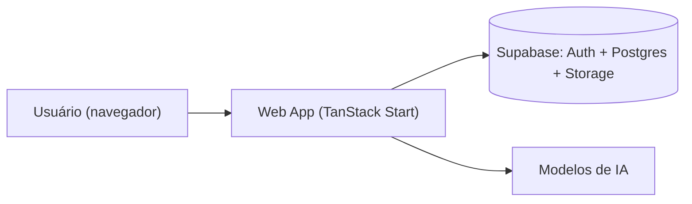

# 🤖 MedIA - Assistente Virtual & Plataforma Corporativa Inteligente

> A fusão da inteligência Arthromed + Medic. Uma plataforma completa de automação operacional, processos internos, suporte técnico T.I, gestão de chamados, módulo anti-glosa e consulta de materiais.

📖 **[Acesse aqui a Documentação Completa da API e Guia do Desenvolvedor](docs/API_DEVELOPER_GUIDE.md)** 🚀

O **MedIA** é o ecossistema corporativo definitivo da **Arthromed & Medic**, combinando Inteligência Artificial de última geração, base de conhecimento RAG dinâmica, gestão de Não Conformidades (NOC), suporte a solicitações médicas (OPME) e central de chamados de T.I.

---

## 🎯 Módulos Corporativos Integrados

### 💬 1. Assistente Chatbot (MedIA)
- **Base de Conhecimento RAG:** Consulta automatizada a processos internos (Faturamento, Orçamentos, Estoque, Logística, Emultec, etc.).
- **Novo Processo Integrado:** *Faturamento Matriz Emultec - Transferência Filial para Matriz* (passo a passo detalhado de exportação XML, nota de transferência e importação no Emultec).
- **Extração Inteligente de Pedidos Médicos (PDF/Imagens):** Leitura de exames, pedidos médicos e cotações com formatação em cards interativos (Paciente, Médico, Hospital, Materiais e Data).
- **Interação por Voz (TTS & STT):** Transcrição de áudio via microfone e leitura das respostas em voz alta.

### 🖥️ 2. Suporte T.I (Gestão de Chamados Técnicos)
- **Fluxo Completo de Atendimento:** Abertura de solicitação, aprovação pelo gestor do setor responsável, fila de atendimento técnico T.I e finalização.
- **Histórico & Chat Interativo:** Troca de mensagens e evidências em tempo real diretamente dentro do chamado.
- **Resolução & SLA:** Registro de devolutiva técnica, tempo decorrido em aberto e cálculo de tempo total de atendimento.
- **Notificações:** Notificações em tempo real por setor e por usuário solicitante.

### ⚠️ 3. NOC (Não Conformidades Operacionais)
- Registro, acompanhamento e tratativas de Não Conformidades Operacionais (NCO).
- Indicadores e controle de qualidade nos fluxos logísticos e comerciais.

### 📄 4. Solicitação Médica (CFM / ANS Anti-Glosa)
- Módulo especializado para emissão e revisão de documentação clínica padronizada anti-glosa.
- Gerador de justificativas para OPME, solicitações cirúrgicas e recursos de negativa técnica.

### 📚 5. Catálogos e Portfólios de Produtos
- **Portfólio Arthromed:** Acesso rápido ao catálogo completo de implantes e produtos ortopédicos.
- **Portfólio Medic:** Soluções e catálogo especializado do ecossistema Medic.

### 🗂️ 6. Armazenamento Seguro de Documentos
- Bucket privado no **Supabase Storage** com pasta isolada por usuário.
- Links de compartilhamento temporários (padrão 48h, máximo 7 dias).
- Auditoria de todo upload, link gerado e download (`document_access_log`).
- Atas de treinamento são arquivadas automaticamente após o download.

---

## 🔔 Sistema de Notificações e Avisos Rápidos

- **Aviso Flutuante na Tela Inicial:** Banner animado em overlay (*bottom-up*) avisando os usuários sobre novos procedimentos e atualizações operacionais (com temporizador regressivo de 10 segundos).
- **Central de Notificações T.I:** Notificações instantâneas sobre aprovações pendentes, respostas de técnicos e conclusão de chamados.

---

## 🛠️ Tecnologias Utilizadas

- **Frontend Web:** React 19, TanStack Start / Router, Tailwind CSS 4, Framer Motion, Lucide Icons.
- **Backend & Serverless:** Cloudflare Workers, Supabase (Autenticação, Database Postgres, Storage, Vector DB RAG).
- **Desktop Application:** Python (`pywebview`, `Pillow`, `pypdf`, `pymupdf`).
- **APIs de IA:** OpenRouter / OpenAI (`text-embedding-3-small` para RAG), Anthropic Claude 3.5 Sonnet.

---

## 🏗️ Arquitetura



```
Prototipo-Chatbot/
├── web/                     # Aplicação principal (frontend + server functions)
│   ├── src/lib/security.ts  # requireAuth(): validação de JWT no servidor
│   ├── src/lib/storage.ts   # Acesso único a arquivos (bucket privado + auditoria)
│   └── src/lib/inactivity.ts# Logout automático por inatividade
├── rls_policies.sql         # Políticas RLS das tabelas
└── storage_documentos.sql   # Bucket privado + tabela de auditoria
```

---

## 🚀 Como Executar o Projeto

### Pré-requisitos
- Node.js (v18+)
- Python 3.10+ (para a versão Desktop App)

### 1. Iniciar a Aplicação Web

```bash
cd web
npm install
npm run dev
```
Acesse no navegador: `http://localhost:3000`

### 2. Rodar Testes

```bash
cd web
npm run test
```

### 3. Deploy para Produção (Cloudflare Workers)

```bash
cd web
npm run deploy
```

### 4. Executar a Aplicação Desktop (Windows Widget)

```bash
pip install requests pywebview pillow pypdf pymupdf
python desktop_app.py --window
```

### 5. Configurar o Banco (Supabase)

No **SQL Editor** do painel do Supabase, execute na ordem:

1. [`rls_policies.sql`](rls_policies.sql) — exige usuário autenticado nas tabelas sensíveis.
2. [`storage_documentos.sql`](storage_documentos.sql) — cria o bucket privado `documentos` e a auditoria.

> Ambos os scripts podem ser executados mais de uma vez sem erro.

---

## 🔒 Segurança em Camadas

O sistema segue um modelo de **defesa em cascata**: cada camada assume que a anterior pode falhar.

| Camada | Proteção | Onde |
|---|---|---|
| 1. Credenciais | Nenhuma senha ou chave fixa no código; tudo via variáveis de ambiente | `.env` / `.dev.vars` |
| 2. Sessão | Logout automático após 30 min sem interação (sincronizado entre abas) | `web/src/lib/inactivity.ts` |
| 3. API | Server functions exigem JWT válido do Supabase (`requireAuth()`) | `web/src/lib/security.ts` |
| 4. Banco | RLS: apenas usuários `authenticated` acessam senhas e históricos | `rls_policies.sql` |
| 5. Arquivos | Bucket privado, pasta por usuário, sem alteração/exclusão pelo app | `storage_documentos.sql` |
| 6. Compartilhamento | Links assinados com expiração (máx. 7 dias) | `web/src/lib/storage.ts` |
| 7. Auditoria | Log somente-anexo de uploads, links e downloads | `document_access_log` |
| 8. Aplicação | Sem `dangerouslySetInnerHTML` em conteúdo dinâmico (anti-XSS) e sem override de *system prompt* (anti prompt injection) | `web/src/components`, `web/src/lib/chat.ts` |

### Variáveis de Ambiente

| Variável | Uso | Onde |
|---|---|---|
| `VITE_SUPABASE_URL` / `SUPABASE_URL` | URL da instância Supabase | `web` |
| `VITE_SUPABASE_KEY` | Chave pública (*publishable*) do Supabase | `web` |
| `SUPABASE_SERVICE_ROLE_KEY` | Chave administrativa — **somente servidor**, nunca no frontend | `web` (server) |
| `AI_GATEWAY_API_KEY` | Acesso aos modelos de IA (OpenRouter / Anthropic) | `web` (server) |

> ⚠️ Arquivos `.env`, `.env.local` e `.dev.vars` **nunca** devem ser versionados.

### Roadmap de Segurança
- [ ] Restringir CORS das rotas em `web/api/` (hoje `*`)
- [ ] Log de logins (IP, dispositivo, horário)
- [ ] MFA (TOTP) para administradores — *adiado*

---

*Desenvolvido por Gabriel Farias para a Arthromed & Medic* 🚀
